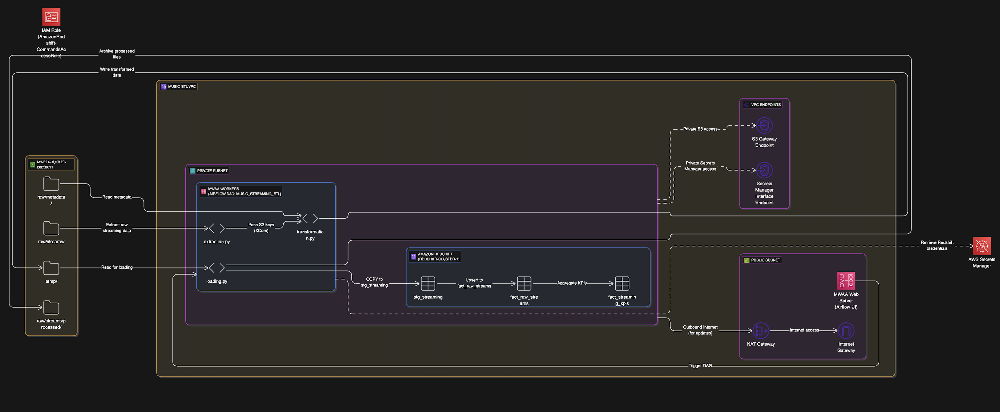
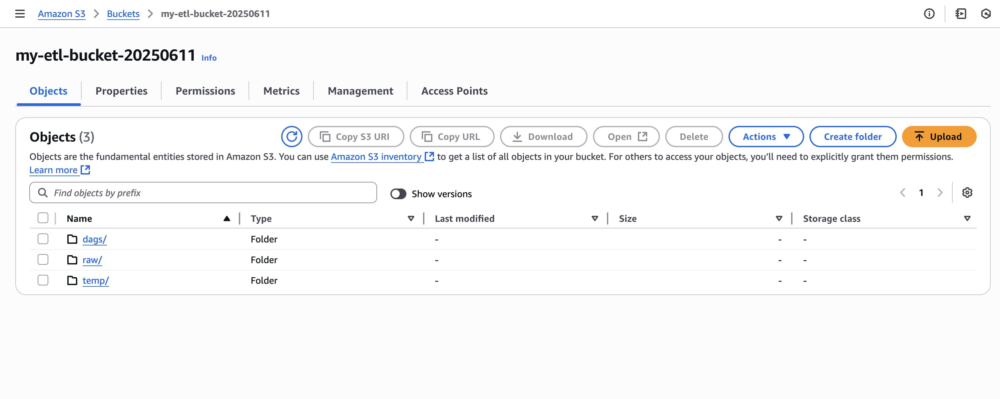
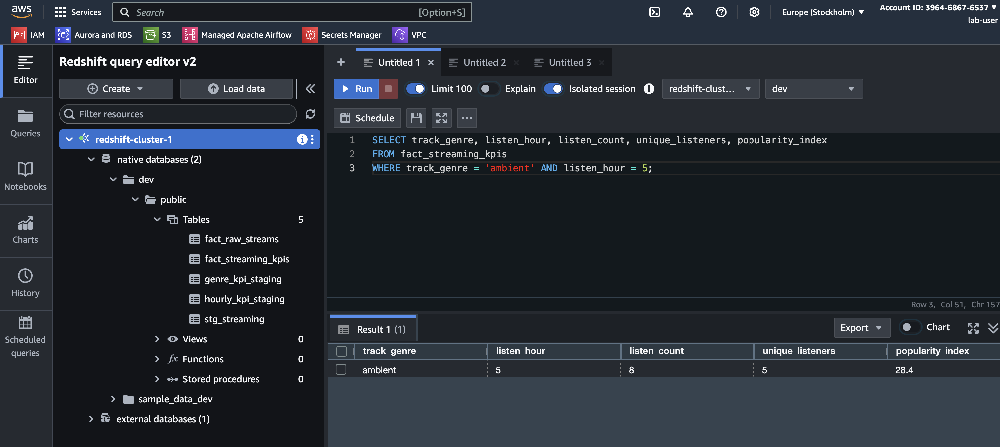
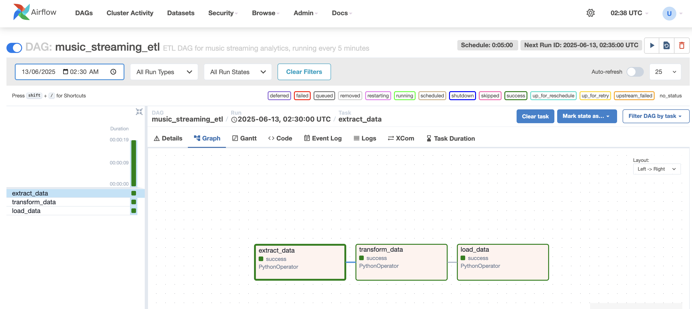
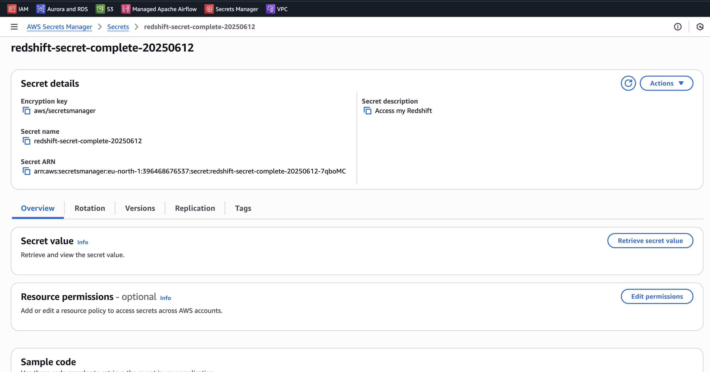

# Music Streaming ETL Pipeline

This repository contains an end-to-end Extract, Transform, Load (ETL) pipeline designed for a music streaming service. The pipeline leverages Apache Airflow for orchestration, Amazon S3 for raw and transformed data storage, AWS Secrets Manager for secure credential management, and Amazon Redshift as the analytical data warehouse. The primary objective is to ingest user and song metadata along with streaming activity, transform it, compute key performance indicators (KPIs), and load the processed data into Redshift for business intelligence and analysis.

## Table of Contents
- [Problem Description](#problem-description)
- [Objective](#objective)
- [Architecture Overview](#architecture-overview)
- [Pipeline Components](#pipeline-components)
  - [Data Extraction (extraction.py)](#data-extraction-extractionpy)
  - [Data Transformation (transformation.py)](#data-transformation-transformationpy)
  - [Data Loading (loading.py)](#data-loading-loadingpy)
  - [Airflow DAG (etl_dag_pipeline.py)](#airflow-dag-etl_dag_pipelinepy)
- [Key Features & Best Practices](#key-features--best-practices)
  - [Cloud Security Enhancements](#cloud-security-enhancements)
  - [Data Reliability & Integrity](#data-reliability--integrity)
  - [Cost Optimization](#cost-optimization)
  - [Operational Excellence](#operational-excellence)
  - [Scalability & Performance](#scalability--performance)
- [Setup and Deployment](#setup-and-deployment)
- [Data Model (Redshift)](#data-model-redshift)
- [Validating Results](#validating-results)
- [Future Enhancements](#future-enhancements)

## Problem Description
A music streaming service requires a robust data pipeline to analyze user streaming behavior. The challenge involves integrating data from disparate sources (simulated RDS for metadata, S3 for streaming data), performing data validation and complex transformations, computing meaningful KPIs, and efficiently loading the processed data into a scalable data warehouse for analytical processing.

## Objective
The main objectives of this ETL pipeline are:
- Ingest user and song metadata (simulated via CSV) and streaming data from Amazon S3.
- Perform necessary data transformations and comprehensive validations to ensure data quality.
- Compute critical KPIs at both genre-level and hourly intervals to provide insights into platform activity, song popularity, and user engagement.
- Load processed and aggregated data into Amazon Redshift, optimized for analytical queries.

### Key Performance Indicators (KPIs) Computed
#### Genre-Level KPIs
- **Listen Count**: Total plays per genre.
- **Average Track Duration**: Mean duration of tracks within a genre.
- **Popularity Index**: A composite score based on play counts and inherent track popularity.
- **Most Popular Track per Genre**: The highest-engagement track within each genre.

#### Hourly KPIs
- **Unique Listeners**: Distinct user count streaming per hour.
- **Top Artists per Hour**: The most streamed artist during each hour.
- **Track Diversity Index**: Measures variety of tracks played in an hour.

## Architecture Overview
The pipeline operates on AWS infrastructure, orchestrated by Apache Airflow (likely managed via AWS MWAA).



- **S3 (my-etl-bucket-20250611)**:
  - Serves as the landing zone for raw streaming data and a temporary staging area for transformed data before Redshift ingestion.
  - Also acts as an archive for processed raw files.
  - **Raw data location**: `s3://my-etl-bucket-20250611/raw/streams/`
  - **Processed archive**: `s3://my-etl-bucket-20250611/raw/streams/processed/`
  - **Temporary transformed data**: `s3://my-etl-bucket-20250611/temp/`

 

- **AWS Secrets Manager**: Securely stores Redshift database credentials, ensuring they are not hardcoded in the application logic.

- **Amazon Redshift (redshift-cluster-1)**: The columnar data warehouse where processed raw data (`fact_raw_streams`) and aggregated KPIs (`fact_streaming_kpis`) are stored for analytical querying.



- **Apache Airflow (MWAA)**: Orchestrates the entire ETL workflow, managing task dependencies, scheduling, and logging.

## Pipeline Components

### Data Extraction (extraction.py)
**Purpose**: Identifies and fetches new, unprocessed streaming data files from S3.

**Mechanism**:
- Lists objects within `s3://my-etl-bucket-20250611/raw/streams/`.
- Filters for `.csv` files that are not located in the `processed/` subfolder.
- Pushes the S3 keys of unprocessed files to Airflow's XCom for the downstream transformation task.

**Best Practice - Idempotency**: The filtering logic (`'processed/' not in item['Key']`) ensures that the same files are not re-processed on subsequent DAG runs, providing a form of idempotency.

**Best Practice - Graceful Handling**: If no new files are found, the function logs a warning and returns an empty list, allowing the DAG to complete successfully without errors, which is crucial for scheduled runs checking for intermittent data.

### Data Transformation (transformation.py)
**Purpose**: Cleans, enriches, and prepares the raw streaming data for Redshift ingestion and KPI computation.

**Mechanism**:
- Pulls the list of unprocessed stream keys from XCom.
- Loads the stream data, along with `users.csv` and `songs.csv` metadata from S3.
- Performs:
  - Data type conversions (e.g., `listen_time` to datetime, IDs to string).
  - Extraction of `listen_hour` from `listen_time`.
  - Merging stream data with user and song metadata.
  - Calculation of `listen_count_user` and `listen_count_track` at the individual event level.
  - Calculation of `popularity_index` at the individual track-stream level.
  - Handling of NaN values by filling with 0 before type conversion for integer columns.
  - Truncation of `artists`, `album_name`, and `track_name` strings to fit Redshift `VARCHAR(500)` limits, preventing "Value too long" errors.
  - Ensures `explicit` column is boolean type.
  - Selects and reorders columns to match the target Redshift `stg_streaming` table schema precisely.
- Uploads the transformed DataFrame to a temporary location in S3 (`s3://my-etl-bucket-20250611/temp/`) as a CSV.

**Best Practice - Data Validation**: `validate_columns` ensures schema integrity at the start of transformation, catching missing columns early.

**Best Practice - Schema Enforcement**: Explicit column selection and reordering help prevent schema drift during loading into Redshift.

**Best Practice - Data Type Consistency**: Pre-emptively handling data types and potential NaN values ensures Redshift compatibility.

### Data Loading (loading.py)
**Purpose**: Loads transformed data into Redshift and performs incremental KPI aggregation.

**Mechanism**:
- Connects to Redshift using credentials retrieved from AWS Secrets Manager.
- **Schema Management**: Dynamically drops and creates `stg_streaming`, `fact_raw_streams`, and `fact_streaming_kpis` tables. This ensures that any schema changes in the Python code are consistently applied to the Redshift cluster.
- **Staging**: Copies the transformed data from the temporary S3 location into `stg_streaming` (a temporary Redshift staging table) using the `COPY` command.
- **Raw Data Upsert (fact_raw_streams)**: Implements an UPSERT strategy (DELETE + INSERT) to merge new stream events from `stg_streaming` into the permanent `fact_raw_streams` table. This prevents duplicate entries and handles re-processing the same stream events.
- **Incremental KPI Aggregation (fact_streaming_kpis)**:
  - Identifies unique `(track_genre, listen_hour)` combinations present in the newly loaded `stg_streaming` data.
  - Recalculates all KPIs (e.g., `listen_count`, `avg_duration_ms`, `popularity_index`, `unique_listeners`, `top_artist`, `track_diversity_index`) for only these affected combinations by performing aggregations over the entire `fact_raw_streams` table. This ensures cumulative accuracy while minimizing computation.
  - Stores these recalculated KPIs in a temporary table, `stg_affected_kpis`.
  - Deletes existing KPI rows from `fact_streaming_kpis` for the affected `(track_genre, listen_hour)` combinations.
  - Inserts the fresh, cumulative KPIs from `stg_affected_kpis` into `fact_streaming_kpis`.
- **File Archiving**: On successful completion of all Redshift operations, the original raw stream file in S3 is moved to the `raw/streams/processed/` subfolder, marking it as fully processed.

**Best Practice - Incremental Processing**: The incremental KPI aggregation logic significantly optimizes performance for large datasets by avoiding full table scans for every run.

**Best Practice - Atomic Operations**: Using `BEGIN; ... COMMIT;` blocks ensures that Redshift DML operations are transactional, meaning they either fully succeed or fully fail, maintaining data integrity.

**Best Practice - Robust Error Handling**: The S3 file moving logic is placed inside the try block, ensuring files are only marked as processed if all database operations successfully complete. This prevents data loss or inconsistent states in case of mid-process failures.

### Airflow DAG (etl_dag_pipeline.py)
**Purpose**: Orchestrates the entire ETL workflow, defining task dependencies and scheduling.

**Mechanism**:
- Defines a DAG named `music_streaming_etl`.
- Uses `PythonOperator` to execute the Python functions for extraction, transformation, and loading.
- Sets up task dependencies: `t1 (extract) >> t2 (transform) >> t3 (load)`.

**Best Practice - Scheduling**: `schedule_interval=timedelta(minutes=5)` ensures the DAG runs every 5 minutes, providing near real-time analytics by frequently checking for new data.



**Best Practice - Concurrency Control**: `max_active_runs=1` is critical to prevent deadlocks and resource contention on the Redshift cluster by ensuring only one instance of the DAG runs at any given time. This is especially important for operations that modify the same tables.

**Best Practice - Logging & Error Handling**: Basic logging is configured in each script, and Airflow's `retries` parameter ensures transient failures are handled automatically.

## Key Features & Best Practices

### Cloud Security Enhancements
- **AWS Secrets Manager Integration**:
  - **Best Practice**: Redshift database credentials (username, password, host, port, dbname) are stored securely in AWS Secrets Manager (`arn:aws:secretsmanager:eu-north-1:396468676537:secret:redshift-secret-complete-20250612-7qboMC`) instead of being hardcoded in the Python scripts.
  - **Benefit**: Prevents sensitive information from being exposed in plaintext, adhering to the principle of least privilege and enhancing overall security posture. Access to the secret is controlled via IAM roles.
  


- **IAM Roles for AWS Service Access**:
  - **Best Practice**: The Airflow environment (MWAA) and Redshift `COPY` operations utilize IAM roles (`arn:aws:iam::396468676537:role/service-role/AmazonRedshift-CommandsAccessRole-20250604T113408`) to grant necessary permissions to S3 and Redshift, rather than using access keys directly.
  - **Benefit**: Provides temporary credentials, simplifies credential rotation, and aligns with AWS security best practices.
- **S3 Bucket Encryption (KMS)**:
  - **Best Practice**: Although not explicitly shown in the code, ensuring the S3 bucket (`my-etl-bucket-20250611`) is configured with Server-Side Encryption (SSE-KMS) using AWS Key Management Service (KMS) for both raw and transformed data.
  - **Benefit**: Encrypts data at rest in S3, adding another layer of security and helping meet compliance requirements.
- **MWAA Environment Encryption (KMS)**:
  - **Best Practice**: The AWS MWAA environment (`mwaa-etl-pipeline`) is encrypted using an AWS KMS key (default `aws/airflow`).
  - **Benefit**: Protects sensitive data stored within the Airflow environment, including logs, task states, and metadata.


### Data Reliability & Integrity
- **Idempotent Extraction**: The `extraction.py` script prevents reprocessing of already moved files, ensuring data is processed only once.
- **Data Validation Module**: `validate_columns` in `transformation.py` ensures that all critical columns are present before processing, preventing downstream errors and maintaining data quality.
- **Transactional Loading (Redshift)**: The use of `BEGIN;` and `COMMIT;` blocks in `loading.py` ensures that upsert operations are atomic. If any part of the transaction fails, the entire transaction is rolled back, preventing partial or corrupted data loads.
- **Error Handling**: Detailed logging and try-except blocks in all Python scripts ensure that errors are caught, logged, and propagated, enabling quick troubleshooting. The DAG is configured with `retries=1` for transient issues.
- **Processed File Archiving**: Moving successfully processed raw files to a `processed/` subfolder in S3 (`raw/streams/processed/`) acts as a robust mechanism for tracking and archiving historical input data, aiding in auditing and disaster recovery.

### Cost Optimization
- **Spot Instances (Potential)**: While not explicitly configured in the provided code, MWAA or Redshift clusters can leverage Spot Instances for worker nodes where appropriate, significantly reducing compute costs for non-critical workloads.
- **S3 Intelligent-Tiering (Potential)**: Configuring S3 buckets with Intelligent-Tiering for data lifecycle management can automatically move less frequently accessed data to cheaper storage tiers, optimizing costs without manual intervention.
- **Redshift Node Sizing & Scaling**: Choosing appropriate Redshift node types and sizes (`ra3.large` with 2 nodes shown in the screenshot) and scaling based on workload can optimize performance-to-cost ratio.
  - **Suggestion**: Link to your actual Redshift cluster screenshot here.
- **Incremental ETL**: Implementing incremental KPI aggregation (Option B in `loading.py`) is a significant cost-saving measure for Redshift. Instead of recomputing all KPIs from scratch (TRUNCATE + INSERT), it only recalculates and updates the affected data slices. This reduces Redshift compute time and associated costs, especially as the `fact_raw_streams` table grows.

### Operational Excellence
- **Apache Airflow Orchestration**: Centralized orchestration with Airflow provides clear visibility into pipeline status, dependencies, and execution history.
- **Frequent Scheduling**: The 5-minute `schedule_interval` ensures that new data is processed promptly, supporting near real-time analytics requirements.
- **Concurrency Control**: `max_active_runs=1` explicitly prevents concurrent DAG runs, eliminating a common source of deadlocks and resource conflicts in the database, leading to more stable operations.
- **XCom for Inter-Task Communication**: Efficiently passes metadata (like S3 keys and temporary file paths) between Airflow tasks without writing to external storage, improving performance and reliability.
- **Detailed Logging**: Comprehensive logging within each Python script (`logging.basicConfig(level=logging.INFO)`) and Airflow's built-in logging features provide granular insights into task execution and aid in debugging.
  - **Suggestion**: Link to your actual Airflow logs screenshot here.

### Scalability & Performance
- **Redshift Columnar Storage**: Redshift's columnar storage and parallel processing capabilities are inherently designed for analytical workloads, making it scalable for large datasets.
- **Redshift Distribution and Sort Keys**: The `fact_streaming_kpis` table uses `SORTKEY` on `track_genre` and `DISTKEY` on `listen_hour`.
  - **SORTKEY**: Improves query performance by enabling Redshift to quickly locate data within sorted columns.
  - **DISTKEY**: Ensures even data distribution across compute nodes based on a frequently queried or joined column, minimizing data movement during query execution.
- **Staging Tables**: Using `stg_streaming` as a temporary staging area isolates incoming data from the main fact tables, allowing for efficient `COPY` operations and then controlled merges/upserts.
- **Optimized SQL for KPIs**: The SQL queries for KPI computation in `loading.py` are carefully crafted using CTEs and window functions for efficient aggregation over potentially large datasets in `fact_raw_streams`.

## Setup and Deployment

### Prerequisites
- AWS Account with appropriate permissions.
- An Amazon Redshift cluster (`redshift-cluster-1`).
- An S3 bucket (`my-etl-bucket-20250611`) with `raw/streams/` and `raw/metadata/` folders.
- Redshift credentials stored in AWS Secrets Manager.
- An AWS Managed Apache Airflow (MWAA) environment.

### Deployment Steps
1. **Configure S3 Bucket**:
   - Create `my-etl-bucket-20250611` in S3.
   - Create folders: `raw/streams/`, `raw/metadata/`, `temp/`, and `raw/streams/processed/`.
   - Upload `users.csv` and `songs.csv` to `raw/metadata/`.
   - Upload initial `streamX.csv` files to `raw/streams/`.
   - Ensure proper bucket policies for access from MWAA and Redshift.
2. **Configure AWS Secrets Manager**:
   - Create a new secret in Secrets Manager (e.g., `redshift-secret-complete-20250612-7qboMC`).
   - Store your Redshift connection details (username, password, host, port, dbname) as a JSON string in the secret.
   - Grant your Airflow execution role permission to retrieve this secret.
3. **Configure Redshift IAM Role**:
   - Ensure your Redshift cluster has an IAM role (`arn:aws:iam::396468676537:role/service-role/AmazonRedshift-CommandsAccessRole-20250604T113408`) with permissions for `s3:GetObject` and `s3:ListBucket` on your S3 bucket, and `redshift-data:ExecuteStatement` (or equivalent) for SQL execution.
4. **Deploy Airflow DAGs**:
   - Upload `etl_dag_pipeline.py`, `extraction.py`, `transformation.py`, and `loading.py` to the DAGs folder of your MWAA S3 bucket.
   - Monitor and Verify:
     - Access the Airflow UI via MWAA.
     - Unpause the `music_streaming_etl` DAG.
     - Monitor DAG runs and task logs for successful completion.

## Data Model (Redshift)

### fact_raw_streams
Stores individual transformed streaming events.

```sql
CREATE TABLE fact_raw_streams (
    user_id INT,
    track_id VARCHAR(100),
    listen_time TIMESTAMPTZ,
    listen_hour INT,
    user_name VARCHAR(100),
    user_age INT,
    user_country VARCHAR(100),
    created_at TIMESTAMPTZ,
    id INT,
    artists VARCHAR(500),
    album_name VARCHAR(500),
    track_name VARCHAR(500),
    popularity INT,
    duration_ms INT,
    explicit BOOLEAN,
    danceability FLOAT4,
    energy FLOAT4,
    key INT,
    loudness FLOAT4,
    mode INT,
    speechiness FLOAT4,
    acousticness FLOAT4,
    instrumentalness FLOAT4,
    liveness FLOAT4,
    valence FLOAT4,
    tempo FLOAT4,
    time_signature INT,
    track_genre VARCHAR(100),
    listen_count_user INT,
    listen_count_track INT,
    popularity_index FLOAT4
);
```

### fact_streaming_kpis
Stores aggregated, cumulative KPIs per genre and hour.

```sql
CREATE TABLE fact_streaming_kpis (
    track_genre VARCHAR(100) SORTKEY,
    listen_count BIGINT,
    avg_duration_ms FLOAT,
    popularity_index FLOAT,
    most_popular_track VARCHAR(1000),
    most_popular_artist VARCHAR(1000),
    listen_hour INTEGER DISTKEY,
    unique_listeners INTEGER,
    top_artist VARCHAR(1000),
    track_diversity_index FLOAT
);
```

## Validating Results
After successful DAG runs, you can query the `fact_streaming_kpis` table in Redshift to verify the calculated KPIs.

### Example Queries
- **Retrieve all KPIs for a specific genre and hour**:
```sql
SELECT
    track_genre,
    listen_hour,
    listen_count,
    avg_duration_ms,
    popularity_index,
    most_popular_track,
    most_popular_artist,
    unique_listeners,
    top_artist,
    track_diversity_index
FROM
    fact_streaming_kpis
WHERE
    track_genre = 'ambient' AND listen_hour = 5;
```

- **Check overall listen counts by genre**:
```sql
SELECT
    track_genre,
    SUM(listen_count) AS total_genre_listens
FROM
    fact_streaming_kpis
GROUP BY
    track_genre
ORDER BY
    total_genre_listens DESC;
```

- **Identify peak listening hours**:
```sql
SELECT
    listen_hour,
    SUM(unique_listeners) AS total_unique_listeners
FROM
    fact_streaming_kpis
GROUP BY
    listen_hour
ORDER BY
    total_unique_listeners DESC;
```

**Suggestion**: Link to your actual Redshift query result screenshot here.

## Future Enhancements
- **Data Quality Monitoring**: Implement more advanced data quality checks (e.g., using Great Expectations) within the transformation stage.
- **Schema Evolution Handling**: Integrate tools or strategies to handle schema changes gracefully without requiring manual `DROP TABLE` operations, especially for `fact_raw_streams`.
- **Backfilling Strategy**: Develop a robust backfilling strategy for historical data processing.
- **Alerting**: Set up CloudWatch alarms or Airflow alerts for task failures, data quality anomalies, or S3 bucket size thresholds.
- **Cost Monitoring**: Integrate AWS Cost Explorer or custom dashboards to monitor Redshift and S3 costs effectively.
- **Performance Benchmarking**: Regularly benchmark the pipeline's performance and optimize Redshift table design (e.g., `DISTSTYLE`, `ENCODING`) for specific query patterns.