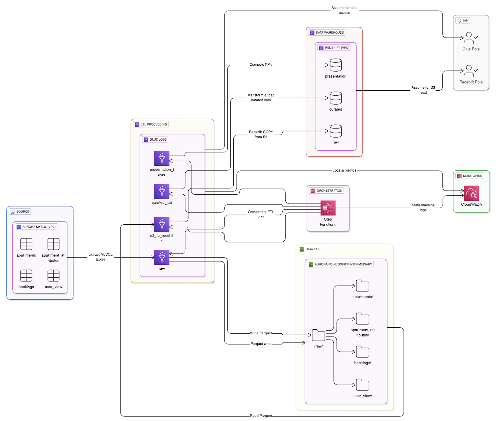
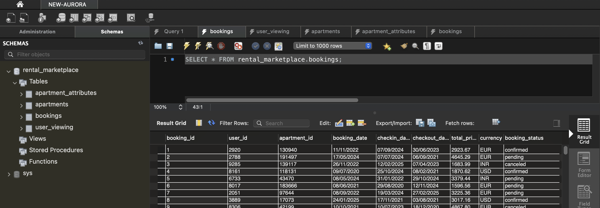
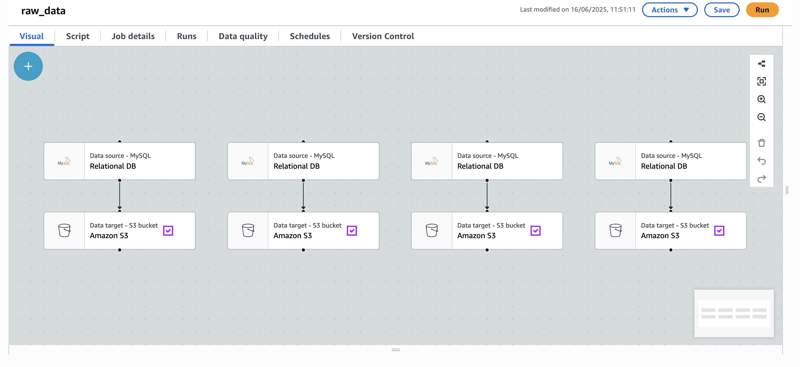
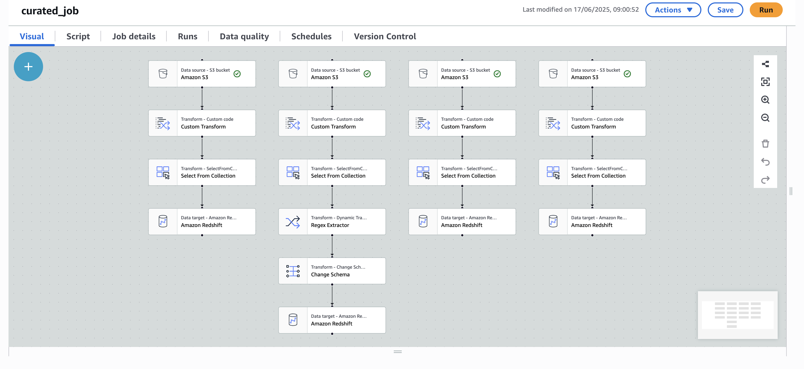
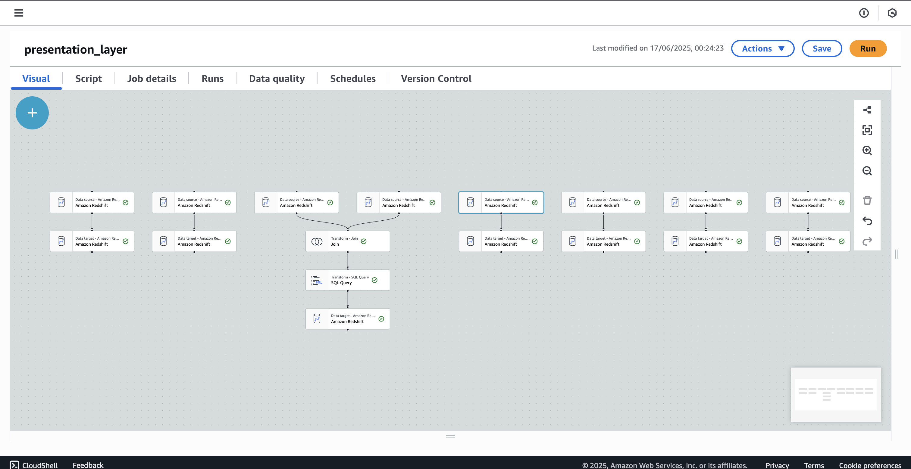
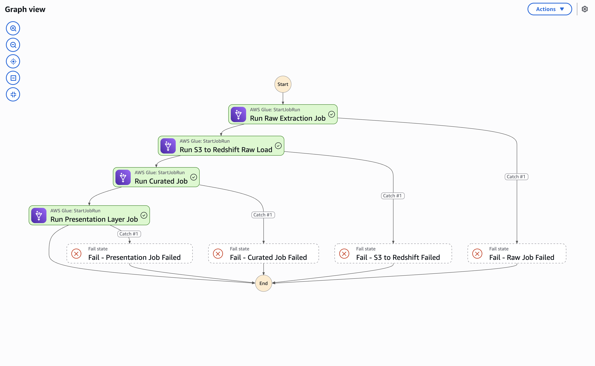
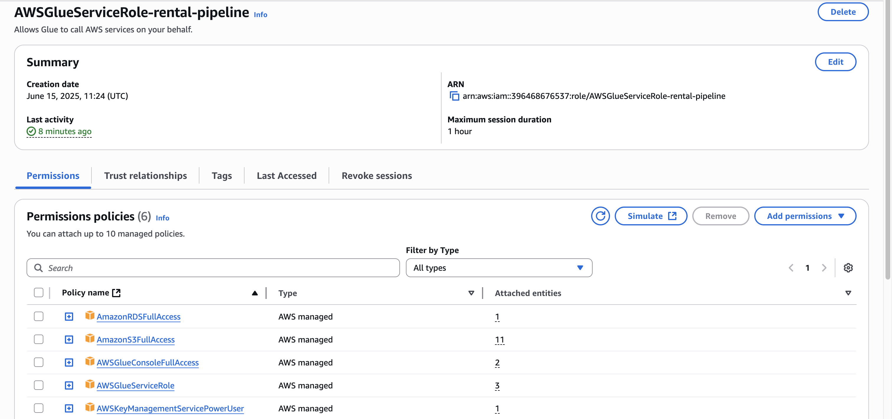

# AWS-Based Rental Marketplace Analytics Pipeline
This project implements an end-to-end data pipeline on AWS to support analytics for a rental marketplace platform (similar to Airbnb). It automates data ingestion, transformation, and reporting to compute key performance indicators (KPIs) such as occupancy rates, top-performing listings, and user engagement metrics using a multi-layer data warehouse architecture on Amazon Redshift.

## Project Overview
The objective of this project is to enable scalable analytics for a rental platform by:

- Extracting data from Amazon Aurora (simulated RDS)
- Storing raw data in Amazon S3 in Parquet format
- Transforming the data and loading it into Redshift using AWS Glue
- Computing KPIs such as average listing price, occupancy rate, and repeat customers
- Automating the ETL process using AWS Step Functions for reliability and maintainability

This architecture supports business intelligence use cases and empowers data analysts to query curated and presentation-layer metrics efficiently.

## Architecture Diagram


## ⚙️ Technologies & Services Used
| Service | Purpose | Why It's Used |
|---------|---------|---------------|
| Amazon Aurora MySQL | Source system for transactional data | Chosen for its serverless, highly scalable, and highly available nature as a relational database service. It simulates real-world production databases, offering high performance and compatibility with MySQL, making it an excellent choice for an OLTP source that can handle transactional workloads. |
| Amazon S3 | Stores raw and curated data in Parquet format | Serves as the central data lake. S3 is highly scalable, durable, and cost-effective object storage, ideal for storing raw, immutable data and processed intermediates (like curated data in Parquet). Its deep integration with other AWS services (like Glue and Redshift Spectrum) makes it a foundational component for data lake architectures. |
| AWS Glue | ETL processing using PySpark | A fully managed, serverless ETL service. Glue eliminates the operational overhead of managing servers for Spark jobs. It's chosen for its ability to discover schemas (with Crawlers), handle schema evolution, and its native integration with S3 for data lake operations and Redshift for data warehousing. PySpark allows for powerful, flexible data transformations. |
| Amazon Redshift | Final data warehouse and analytics platform | A fully managed, petabyte-scale cloud data warehouse designed for high-performance analytics. Its columnar storage and massively parallel processing (MPP) architecture enable fast query execution on large datasets, making it ideal for business intelligence, reporting, and complex SQL analytics on the curated and presentation layers. |
| AWS Step Functions | Orchestration of ETL jobs | A serverless workflow service that allows defining complex, multi-step ETL processes as state machines. It's chosen for its reliability, built-in error handling, retry mechanisms, and ability to coordinate multiple Glue jobs (and other AWS services) into a robust, observable, and auditable workflow, ensuring the end-to-end pipeline executes reliably. |
| AWS IAM Roles | Secure access and permissions across services | Essential for enforcing the principle of least privilege. IAM roles provide a secure way for AWS services (like Glue and Redshift) to interact with each other without needing to embed credentials directly in code. They ensure that each component only has the necessary permissions to perform its specific task, enhancing the overall security posture of the pipeline. |
| AWS CloudWatch | Monitoring and logging | Provides comprehensive monitoring of AWS resources and applications. It's used for collecting logs from Glue jobs and Step Functions, setting up alarms for pipeline failures, and tracking custom metrics, which is crucial for operational visibility and quick issue resolution. |

## 🛠️ Pipeline Setup & Configuration
### 1. Aurora MySQL Setup
**Simulation**: The source system was simulated using Amazon Aurora MySQL. This provided a realistic environment for transactional data, mimicking a production rental marketplace database.

**Tables**: Key tables such as `users`, `apartments`,`apartment_attributes` and `bookings` were created to hold the raw transactional data.

**Data Ingestion**: Data was ingested from sample CSV files to populate these tables.

**S3 Export Configuration**: Aurora was configured with an IAM role granting necessary permissions for data export to Amazon S3, enabling efficient data extraction for the raw Glue job.



### 2. Glue Job: raw
**Purpose**: This job is responsible for the initial data ingestion from the Aurora MySQL source system.

**Transformations**: It extracts data from Aurora, performs minimal transformations (primarily ensuring type compatibility where necessary), and loads it directly into Amazon S3 in Parquet format.

**Output Location**: Data is stored in the `s3://your-bucket/raw/` path, maintaining the original schema as much as possible for future auditability.

**Schema Evolution**: Glue's DynamicFrame capabilities are leveraged to handle potential schema evolution from the source, ensuring new fields or changes are gracefully managed without breaking the pipeline.



### 3. Glue Job: s3_to_redshift
**Purpose**: This job takes the raw Parquet data stored in S3 and loads it into the Redshift Raw Schema.

**Data Loading**: It utilizes AWS Glue's optimized connectors to efficiently copy data from S3 into Redshift.

**DynamicFrame Usage**: AWS Glue DynamicFrame is crucial here as it allows handling of semi-structured data and schema flexibility, mapping the Parquet structure directly to the Redshift raw tables.


### 4. Glue Job: curated_job
**Purpose**: This job is the core transformation stage, cleaning and enriching the raw data.

**Transformations**:
- **Data Type Casting**: Explicitly casts columns to correct data types (e.g., converting VARCHAR dates to DATE where appropriate, as was a common challenge).
- **Bad Record Filtering**: Implements logic to identify and filter out malformed or incomplete records, ensuring data quality.

**Output**: Loads the transformed, cleaned, and enriched data into the Redshift Curated Schema.


### 5. Glue Job: presentation_layer
**Purpose**: This final transformation job focuses on computing aggregate business KPIs ready for consumption by dashboards and reports.

**Calculations**: It performs complex joins across tables in the curated schema.

**Aggregation**: Data is aggregated by various dimensions, such as weekly or monthly, to derive key performance indicators.

**Output**: Populates the tables within the Redshift Presentation Schema, which are optimized for read performance and direct analytical querying.


### 6. AWS Step Functions Orchestration
**State Machine**: A single state machine (`etl-pipeline-orchestrator`) was defined to manage the entire ETL workflow.

**Execution Sequence**: The state machine orchestrates the Glue jobs in a defined sequence: `raw` → `s3_to_redshift` → `curated_job` → `presentation_layer`.

**Reliability**: Configured with robust error handling, including automatic retries for transient failures and defined catch states for more significant errors, ensuring the pipeline's resilience.

**Monitoring**: Integrated with CloudWatch for detailed logging of each step's execution status, allowing for easy monitoring and debugging.



### 7. IAM Roles Configuration
**Principle of Least Privilege**: IAM roles were meticulously configured to grant each AWS service (Glue, Redshift, S3) only the minimum necessary permissions to perform its designated tasks.

**Cross-Service Access**: Roles enabled secure communication and data transfer between S3 buckets, Glue jobs accessing Redshift, and Redshift performing COPY operations from S3. This minimized security risks and adhered to best practices.


### 8. Redshift Schema Definitions
The Redshift data warehouse follows a multi-layered architecture (raw, curated, presentation) to ensure data quality, usability, and performance.

#### raw Schema:
The raw schema holds data directly ingested from the source with minimal transformations.

```sql
CREATE TABLE raw.apartment_attributes (
    id INT,
    category VARCHAR(255),
    body TEXT,
    amenities TEXT,
    bathrooms INT,
    bedrooms INT,
    fee DECIMAL(10, 5), -- Original definition
    has_photo BOOLEAN,
    pets_allowed BOOLEAN,
    price_display VARCHAR(255),
    price_type VARCHAR(255),
    square_feet INT,
    address VARCHAR(255),
    cityname VARCHAR(255),
    state VARCHAR(255),
    latitude DECIMAL(10, 5),
    longitude DECIMAL(10, 5)
);
```

#### curated Schema:
The curated schema contains cleaned, transformed, and integrated data.

**curated.apartment_attributes**:
```sql
CREATE TABLE curated.apartment_attributes (
    id INT,
    category VARCHAR(255),
    body TEXT,
    amenities TEXT,
    bathrooms INT,
    bedrooms INT,
    fee DOUBLE PRECISION, -- Changed to DOUBLE PRECISION for broader range/precision in curated layer
    has_photo BOOLEAN,
    pets_allowed BOOLEAN,
    price_type VARCHAR(255),
    square_feet INT,
    address VARCHAR(255),
    cityname VARCHAR(255),
    state VARCHAR(255),
    latitude DECIMAL(10, 5),
    longitude DECIMAL(10, 5),
    price DOUBLE PRECISION, -- New column for standardized price
    price_display_new DECIMAL(10, 5) -- New column for a new display format for price
);
```

**curated.apartments**:
```sql
CREATE TABLE curated.apartments (
    id INT,
    title VARCHAR(255),
    source VARCHAR(255),
    price DOUBLE PRECISION,
    currency VARCHAR(10),
    listing_created_on DATE,
    is_active BOOLEAN,
    last_modified_timestamp DATE
);
```

**curated.bookings**:
```sql
CREATE TABLE curated.bookings (
    booking_id INT,
    user_id INT,
    apartment_id INT,
    booking_date VARCHAR(255),     -- Stored as VARCHAR initially due to source format variability
    checkin_date VARCHAR(255),
    checkout_date VARCHAR(255),
    total_price DECIMAL(10, 5),
    currency VARCHAR(10),
    booking_status VARCHAR(255)
);
```

**Specific Considerations for curated.bookings**: The `booking_date`, `checkin_date`, and `checkout_date` columns were initially defined as VARCHAR(255) because the source data presented these dates as strings with potentially varying formats. During the `curated_job` Glue ETL step, these string dates are explicitly converted to DATE data types using PySpark's date conversion functions (`to_date()`) before being loaded into `curated.bookings`. This ensures proper date operations and avoids the "Why is it not working" error previously encountered with `DATE_TRUNC` by ensuring the data is in a proper DATE format when used in queries.

**curated.user_viewing**:
```sql
CREATE TABLE curated.user_viewing (
    user_id VARCHAR(255),
    apartment_id VARCHAR(255),
    viewed_at DATE,
    is_wishlisted BOOLEAN,
    call_to_action VARCHAR(255)
);
```

## 📊 KPIs Computed (Redshift presentation Schema)
| Metric | Frequency | Description |
|--------|-----------|-------------|
| avg_listing_price_weekly | Weekly | Average price of active listings |
| occupancy_rate_monthly | Monthly | Percentage of booked nights vs available nights |
| most_popular_locations_weekly | Weekly | Cities with the highest bookings |
| top_performing_listings_weekly | Weekly | Listings with highest total revenue |
| total_bookings_per_user_weekly | Weekly | How often users make bookings |
| avg_booking_duration_weekly | Weekly | Average nights booked per stay |
| repeat_customer_rate_monthly | Monthly | Count of users who booked more than once |

## Data Validation & Testing
**Null Handling & Schema Mismatch Resolution**: A significant focus was placed on resolving issues where new columns appeared as NULL after data loading. This was primarily tackled by:

- **Explicit Type Mapping in Glue**: The `ApplyMapping` transformation in AWS Glue ETL jobs was meticulously configured to explicitly define the mapping between source columns and target Redshift columns, ensuring only intended columns were loaded and correctly typed. This prevented Glue from implicitly inferring or creating NULL columns due to schema discrepancies between source and target.
- **Redshift DDL Consistency**: Ensured that the `CREATE TABLE` DDL statements in Redshift precisely matched the expected output schema from the Glue jobs.
- **Data Type Conversion**: Specific attention was paid to VARCHAR date fields (e.g., `booking_date`) in the `curated.bookings` table. These were explicitly converted to DATE data types within the Glue ETL jobs using PySpark functions (`F.to_date()`) to prevent query errors related to type casting in Redshift.
- **SQL Checks**: Rigorous SQL checks were applied at each layer (raw → curated → presentation) in Redshift to ensure:
  - Expected record counts and data volume.
  - Valid date partitions and range checks.
  - No unexpected schema drift or data type mismatches after each transformation stage.
- **Test Queries**: Ad-hoc and pre-defined test queries were executed against each layer's output tables to validate data integrity, transformation logic, and KPI accuracy.

## Best Practices Followed
- **Parquet Format**: Utilized Parquet format for efficient storage and I/O in S3, leveraging its columnar compression and schema evolution capabilities.
- **Layered Redshift Architecture**: Implemented a multi-layered Redshift architecture (raw, curated, presentation) to ensure data quality, enhance usability, and optimize performance for different analytical needs.
- **Glue DynamicFrame**: Leveraged Glue DynamicFrame for flexible schema handling and efficient processing of semi-structured data, particularly useful during schema evolution.
- **Retry Mechanisms in Step Functions**: Configured Step Functions with robust retry mechanisms to handle transient failures, improving pipeline reliability and reducing manual intervention.
- **Least Privilege IAM Roles**: Adhered strictly to the principle of least privilege, configuring granular IAM roles for each service interaction to enhance security.
- **CloudWatch Metrics and Logging**: Enabled comprehensive CloudWatch metrics and logging across all pipeline components for proactive monitoring, debugging, and operational insights.
- **Job Modularization**: Designed Glue jobs with single responsibilities (e.g., raw ingestion, curation, presentation calculation) to improve maintainability, testability, and reusability.
- **SQL Version Control**: Maintained all SQL scripts (e.g., Redshift DDL, KPI queries) under version control for repeatability, transparency, and collaborative development.

## How to Run the Pipeline
- **Update Source Data**: Ensure your Aurora data is updated, or new CSVs are uploaded to the designated S3 location if applicable.
- **Start Step Function**: Initiate a new execution of the main Step Function (`etl-pipeline-orchestrator`) via the AWS Step Functions console.
- **Monitor Jobs**: Observe the progress and status of each individual Glue job via the AWS Glue console or detailed logs in AWS CloudWatch Logs.
- **Query KPIs**: Once the Step Function execution completes successfully, you can query the presentation schema tables in Amazon Redshift to access the computed KPIs.

## 📎 Resources
- [AWS Glue Documentation](https://docs.aws.amazon.com/glue/)
- [Amazon Redshift Documentation](https://docs.aws.amazon.com/redshift/)
- [Step Functions Developer Guide](https://docs.aws.amazon.com/step-functions/)
- [Best Practices for Data Lakes](https://aws.amazon.com/big-data/datalakes-and-analytics/)

